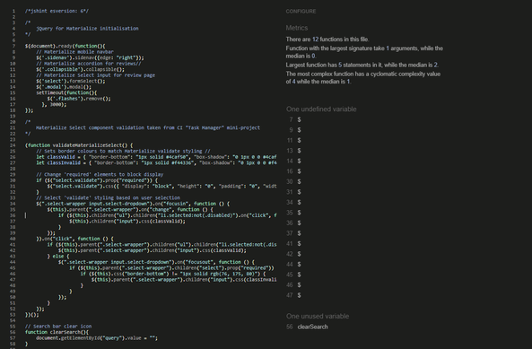
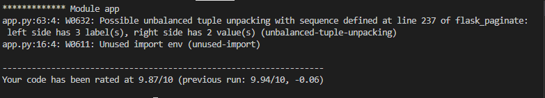
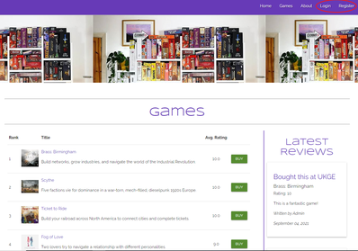
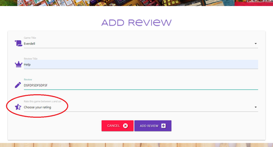
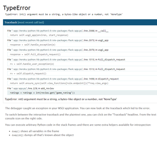

# Game Shelf

Game Shelf is a site that hopes to provide easily accessible reviews and details of tabletop board games. The site will be targeted towards existing tabletop board game players and collectors who are looking for new games to play and collect, but also aimed at new gamers who may not know where to start. Game Shelf will be useful for gamers to find detailed reviews of games they may be interested in, and allow them to find all the necessary details of games.


### [See live site.](https://nick-game-shelf.herokuapp.com/)

## Table of Contents

> -	[Overview](#overview)
> -	[Description](#description)
> -	[UX](#ux)
> -	[Features](#features)
> -	[Technologies Used](#technologies-used)
> -	[Testing](#testing)
> -	[Project bugs and solutions](#project-bugs-and-solutions)
> - [Deployment](#deployment)
> -	[Credits](#credits)
> - [Acknowledgements](#acknowledgements)

## Overview
Tabletop gaming is taking the world by storm right now, and the board games industry is booming. There are now literally hundreds of games being published every year, and there has never been a better time to be a gamer, or to get involved. But it can be a minefield to negotiate and find the *right* games, whether you're a seasoned board gamer or complete newcomer. **_Game Shelf_** aims to provide accurate and comprehensive board game information and reviews that are easily accessible to everyone, and make choosing your next (or first!) board game as straightforward as possible.


## Description
**_Game Shelf_** is a board games review site built with a mobile-first design, but intended to be accessible on all devices. My aim with the project is to present the most relevant information alongside easily digestible reviews to enable users to quickly and easily decide which games to play next.

## User Experience (UX)

-   ### User stories

    -   #### First Time Visitor Goals

        1. As a First Time Visitor, I want to easily understand the main purpose of the site and learn more about board games.
        2. As a First Time Visitor, I want to be able to easily navigate the site to find content.
                       
    -   #### Returning Visitor Goals

        1. As a Returning Visitor, I want to find information about games I may want to play
        2. As a Returning Visitor, I want to share my reviews of games I have played     

    -   #### Frequent User Goals

        1. As a Frequent User, I want to check to see if there are any new reviews.
        2. As a Frequent User, I want to organise reviews I've written on my profile.

    -   #### Site Owner Goals

        1. As a Site Owner, I want to earn money on games purchased through affiliate links  

 
## Scope
* 

## Structure

The website is split into four main sections - a home (landing) page, a games catalogue page, an about page and user profile page. The fixed navbar allows the user to easily navigate the site, and presents a consistent layout, while the toggle feature makes the navbar more accessible for mobile and tablet devices whilst maintaining consistent positioning. The Home page displays a prominent header image and site message, with further information accessible on the About page. The Games page is clean and simple, ranking the games based on average user rating. Each game on the Games page links to individual games pages with additional information on each game. The About page provides users an easy way to give feedback and contact the site owner. The Profile page contains the primary CRUD functionality, with users able to add, read, edit and delete their own reviews for games. 

## Skeleton

* Home Page: <a href="static/docs/wireframes/home.pdf" target="_blank">Home</a>
* Games Page: <a href="static/docs/wireframes/games.pdf" target="_blank">Games</a>
* Individual Games Page: <a href="static/docs/wireframes/individual-game.pdf" target="_blank">Game Pages</a>
* About Page: <a href="static/docs/wireframes/about.pdf" target="_blank">About</a>
* Profile Page: <a href="static/docs/wireframes/profile.pdf" target="_blank">Profile</a>

## Surface

### Images
* Header images are by [Ross Connell](https://www.moregamesplease.com/) for premium, professional board game photography. 
* Footer image is 'Coloured Pencils' by [Jess Bailey](https://unsplash.com/@jessbaileydesigns?utm_source=unsplash&utm_medium=referral&utm_content=creditCopyText) on [Unsplash](https://unsplash.com/?utm_source=unsplash&utm_medium=referral&utm_content=creditCopyText)

### Colours
* Colours were largely chosen from the Materialize Color Palette for ease of implementation. Plump Purple/Deep Purple (#673AB7) was chosen as the main site brand colour, with white as the main background colour to provide plenty of contrast for darker elements and text.

 

* Plump Purple (#673AB7) - Main brand colour
* White (#FFFFFF) - Main background colour
* Black (#000000) - Main text colour

* The site features several different button types for different functions, so it was important to differentiate these with different colours. 'Buy' buttons were coloured with 'Maximum Green' (#558B2F) to convey a 'positive' impression and encourage clicks. 'Fuchsia Crystal' (#BA68C8) was used for Add/Edit Review buttons to stand out from the 'Buy' buttons while also tying in with the main site purple colour. 'Ruby' (#D81B60) was used for 'Delete' buttons to convey a user warning. 'Light Sky Blue' (#90CAF9) was used for Add/Edit Game buttons to differentiate from the 'Review' buttons


* Maximum Green #558B2F
* Fuchsia Crystal #BA68C8
* Ruby #D81B60
* Light Sky Blue #90CAF9

### Typography
* I used Google Fonts to browse interesting fonts. 'Syncopate' was used for headings as it is clear and easy to read but in keeping with the 'gaming' theme. 'Raleway' was used for the bulk of the page text, as it pairs well with 'Syncopate' and presents an easy-to-read larger character font.

### Icons
* Icons were used to aid visual user navigation and make forms as intuitive as possible. All icons are provided by Font Awesome.

## Features
#### Navbar
* I wanted users to easily be able to navigate the site from every page.
* The navbar resizes responsively into a toggle button at smaller screen sizes, to enable users to still navigate their way around the site.
* The navbar uses a colour change hover effect on the other links whilst navigating to a new page.
* The user can click on site title to take the user back to the Home page.
* The search box allows users to quickly search the games catalogue.

#### Home 
* Contains prominent header image and direct site message to immediately catch user's attention and indicate the site's purpose.

#### Games
* Lists games in order of average user rating, so users can easily see which games have highest ratings.
* 'Buy' button for each game links to external affiliate link 
* 'Add Review' button allows users to quickly and easily add reviews for games directly from Games page
* 'Edit Game' button for 'admin' users to quickly and easily update games in the database.

#### Individual Games Pages
* Displays game cover art
* Prominently displays average game rating, as well as user rating when applicable. 
* Displays full game details, detailed description and all reviews for each game. 

#### About
* Details what the site is about and how to use the site. 

#### Profile
* Allows users add, edit, read and delete their reviews.
* Allows 'admin' users to add new games to the database.

#### Footer
* Provide links to social media with handy icons for easy navigation


### Existing Features


### Features Left to Implement


## Technologies Used

#### Languages:
* [HTML](https://en.wikipedia.org/wiki/HTML)
* [CSS](https://en.wikipedia.org/wiki/CSS)
* [JavaScript](https://en.wikipedia.org/wiki/JavaScript)
* [Python](https://en.wikipedia.org/wiki/Python_(programming_language))
* [Flask](https://en.wikipedia.org/wiki/Flask_(web_framework))
* [MongoDB](https://en.wikipedia.org/wiki/MongoDB)

#### Libraries & Frameworks:
* [Balsamiq](https://balsamiq.com/) - Used for the creation of wireframes.
* [FontAwesome](https://fontawesome.com/) - Used for all form icons, as well as search bar and menu toggle icons.
* [Lucid](https://lucid.co/) - Used to map out user interaction and CRUD functionality. 
* [JQuery](https://jquery.com) - The project uses JQuery to simplify DOM manipulation.
* [GoogleFonts](https://fonts.google.com/) - 'Syncopate' and 'Raleway' fonts.
* [Materialize](https://materializecss.com/) - Modern responsive front-end framework based on Material Design, used to construct the majority of visual elements of the site.

#### Version Control:
* [Github](https://github.com/) - Used to store the code 
* [Gitpod](https://gitpod.io/) - Used as the primary version control IDE for development to further push and commit code to GitHub.
* [Heroku](https://www.heroku.com/home) - Used to deploy the live site

#### Other:
* [Code Institute Course Content](https://courses.codeinstitute.net/) - Primary source of learning code.
* [Stack Overflow](https://stackoverflow.com/) - Used for general troubleshooting and examples.
* [W3Schools](https://www.w3schools.com/) - Used for examples and tutorials.
* [ChromeDevTools](https://developers.google.com/web/tools/chrome-devtools) - Used frequently to detect any issues/bugs or layout differences.

---

## Testing
* Forms testing: to ensure the website was functioning as it should, I tested each of the forms on different devices and browsers. This was done by clicking the 'Submit' button on the Add & Edit Review forms, and on the Add & Edit Games forms without any text in inputs to make sure they resulted in the desired response of 'Please fill out this field'. Each 'required' input was tested individually on all forms to ensure the validation responded appropriately each time.

* Links (Internal & External): Each of the links when clicked have been checked so that the user is directed to the desired location. For a better UX experience, all external links included a target="_blank" attribute so that a new browser tab is opened when clicked.

* Testing across various devices: I used BrowserStack for this, in addition to feedback from my friends and peers. The devices on which the website was tested are as follows:

* Tested on Chrome, Firefox, Safari and Microsoft Edge

* Ensured the website was also responsive on all pages through [Google Mobile Friendly Test](https://search.google.com/test/mobile-friendly).


### Validation

**HTML** and **CSS** code were validated with the W3C Markup and CSS validators. 

<details>
<summary><b>HTML</b></summary>

</details>
<details><summary><b>CSS</b></summary>

[W3C](https://jigsaw.w3.org/css-validator/) - CSS Validation


</details>

Javascript code was run through [JSHint](https://jshint.com/) to ensure it was syntactically correct.

<details>
<summary><b>Javascript</b></summary>


</details>


Pylint was used to validate Python code. Any errors were corrected and re-run until correct. 

<details><summary><b>Python</b></summary>



* The unbalanced tuple is part of the pagination code, and does not produce an actual error.
* A warning regarding unused-imports remains as the linter is unable to recognise the use of variables in env.py.

</details>


### Project Bugs and Solutions
* CSS for page overflow and x-scrolling meant the games catalogue table was cutting off anything that went beyond the edge of the screen on mobile devices; removing overflow:hidden meant that any horizontal scrolling moved the whole page (leaving ugly whitespace on the righthand side of the page). In order to add x-scrolling to the catalogue table only, I found and used an answer from [Serge Stroobandt](https://stackoverflow.com/a/30423904) on Stack Overflow which meant users are able to scroll horizontally in the table only without compromising the layout of the table itself, or adding any whitespace to other elements on the page.
* Adding 'if' condition to check for existing user reviews on the individual game pages inadvertently prevented non-registered users from viewing the games at all, as the 'user' key couldn't be found (because 'user' was only created on login). 




In order to fix this, I introduced an additional first 'if' condition to check whether there was a 'user' in the session, and then used Jinja templates on the view_game.html page to add several 'if/else' conditions to alter the displayed HTML depending on the 'user' status, and to bypass the existing_review 'if' condition if there is no session 'user'.

 

* During testing, I found it was possible for users to submit reviews without selecting a rating, which led to a TypeError on the screen while still creating a review in the database with a game rating equal to 'None'. To prevent this, I added the 'required' attribute to the rating select input on both the 'Edit Review' and 'Add Review' forms which had not been present previously.





### Testing User Stories

## Deployment

### GitHub

* Go to [GitHub](https://github.com/) and sign in, or sign up for an account.
* Once a Github account was created, I opened a new repository by clicking the green button "new". To create this project, I used the Code Institute's student 
[template](https://github.com/Code-Institute-Org/gitpod-full-template).
* Click on the green "gitpod" button to open [Gitpod](https://gitpod.io/), a cloud-based version control software or IDE, which was used to write all code for this project.
* It was then pushed or saved in the terminal to Github where it is stored in a [repository](https://github.com/NickChapman1988/game-shelf)

### Heroku

The project was deployed to Heroku using the following steps:

1. Create a "requirements.txt" file using the `pip3 freeze --local > requirements.txt` command.
2. Create a Profile using the `echo web: python app.py > Procfile` command.
3. Delete the blank line at the bottom of the Procfile, as this can sometimes cause problems when running the app on Heroku.
4. Add, commit and push these new files to GitHub.
5. Navigate to [Heroku](https://www.heroku.com/home) and log in to the dashboard.
6. Click "Create a New App".
7. Enter a unique app name and select the closest region ('Europe' in my case).
8. Click "Create App".
9. Under 'Deployment Method' click GitHub.
10. Once the GitHub profile is displayed, add the GitHub repository name then click "Search".
11. Once the repository is found, click to connect to the app.
12. As the environment variables are hidden in an env.py file, these need to be added to the Config Vars in Heroku
13. Go to the 'Settings' tab for the app, then click on "Reveal Config Vars" and enter the key:value pairs from the env.py file. 
14. Back in the 'Deploy' tab, click "Enable Automatic Deployment" then below that, make sure the main branch is selected and click "Deploy Branch" 
15. Once the app has successfully deployed, click "View" to launch the app.

### Forking the GitHub Repository

Forking the GitHub repository creates a copy of the original repository on your own GitHub account to view and/or make changes without affecting the original repository; use the following steps to fork:

1. Log in to GitHub and locate the GitHub [repository](https://github.com/NickChapman1988/game-shelf)
2. At the top of the repository above the "Settings" button on the menu, locate the "Fork" button.
3. You should now have a copy of the repository in your own GitHub account.

### Making a local Clone

1. Log in to GitHub and locate the GitHub [repository](https://github.com/NickChapman1988/game-shelf)
2. At the top of the repository, click the "Code" button (next to the green "Gitpod" button)
3. Under "Clone with HTTPS", copy the URL provided
4. Open Git Bash
5. Change the current working directory to the location where you want the cloned directory
6. Type `git clone`, and then paste the URL you copied in Step 3.

```
$ git clone https://github.com/YOUR-USERNAME/YOUR-REPOSITORY
```

7. Press Enter. Your local clone will be created.

```
$ git clone https://github.com/YOUR-USERNAME/YOUR-REPOSITORY
> Cloning into `CI-Clone`...
> remote: Counting objects: 10, done.
> remote: Compressing objects: 100% (8/8), done.
> remove: Total 10 (delta 1), reused 10 (delta 1)
> Unpacking objects: 100% (10/10), done.
```

Click [here](https://help.github.com/en/github/creating-cloning-and-archiving-repositories/cloning-a-repository#cloning-a-repository-to-github-desktop) to retrieve pictures for some of the buttons and more detailed explanations of the above process.

## Credits
* Header images are by [Ross Connell](https://www.moregamesplease.com/), used with permission. 
* Footer image 'colored pencils' by [Jess Bailey](https://unsplash.com/@jessbaileydesigns?utm_source=unsplash&utm_medium=referral&utm_content=creditCopyText) on [Unsplash](https://unsplash.com/?utm_source=unsplash&utm_medium=referral&utm_content=creditCopyText)
* Horizontal scrolling added to games catalogue table thanks to [this answer](https://stackoverflow.com/a/30423904) from Serge Stroobandt on Stack Overflow.
* Pagination on Games page adapted from [this demo](https://gist.github.com/mozillazg/69fb40067ae6d80386e10e105e6803c9) by Huang Huang on GitHub. Thanks to Krisztina Sarolta Szabo on Slack for the link.
* Seach bar clear icon adapted from [this answer](https://stackoverflow.com/a/33683886) by Josh Crozier on Stack Overflow.
* 'Delete Review' modal thanks to Ed Bradley and Gwen Bradbury on Slack for [this walkthrough](https://code-institute-room.slack.com/archives/C7JQY2RHC/p1608734268405400)
  

## Acknowledgements
* My Mentor, Nishant Kumar, for his guidance throughout this project.
* Thanks to Gwen Bradbury and Ed Bradley on Slack for tackling the 'defensive programming' modal
* Huge thanks to Sean Murphy, Miklos Sarosi, and especially Jo Heyndels from Tutor Support for their patience, support and tutoring!
* My family and friends for their feedback and help with testing.
* As ever, eternal thanks and love to my wife and son for their endless patience, support and lending of devices for testing!

