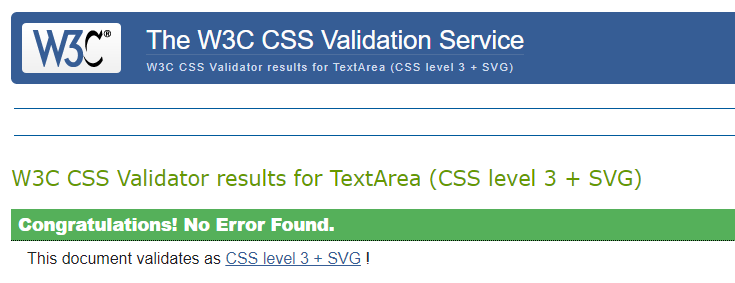
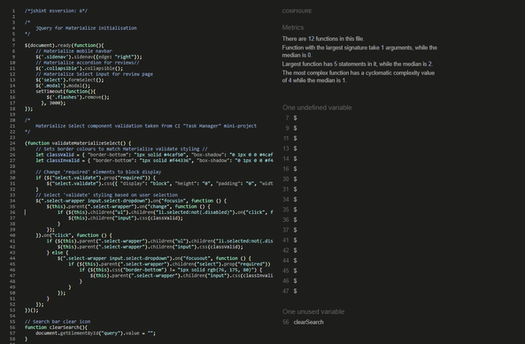
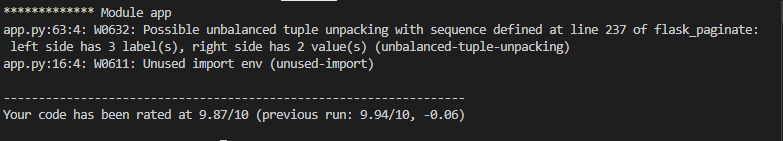
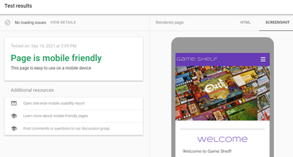
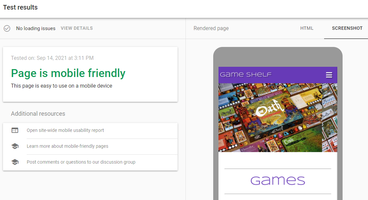
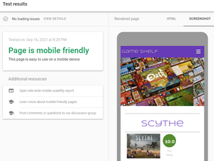
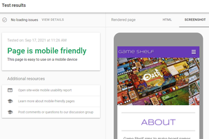
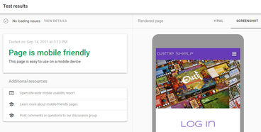
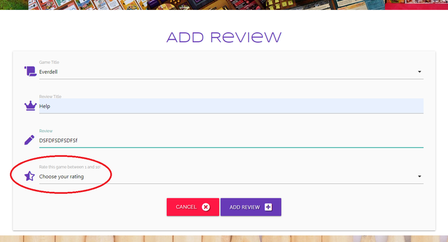
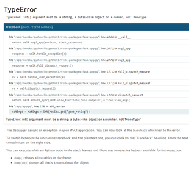

# Testing

[README.md](README.md)

## Table of Contents

- [Automated Testing](#Automated-Testing)
  - [Validation](#Validation)

- [Manual Testing](#Manual-Testing)
  - [Testing Environments](#Testing-Environments)
  - [Testing Methodology](#Testing-Methodology)
  - [Unit Testing](#Unit-Testing)
  - [Peer Code Review](#Peer-Code-Review)
  - [Student Checklist](#Student-Checklist)
- [Project Bugs and Solutions](#Project-Bugs-and-Solutions)
- [Known Issues](#Known-Issues)
- [Testing User Stories](#Testing-User-Stories)

## Automated Testing

### Validation

**HTML** and **CSS** code were validated with the W3C Markup and CSS validators. 

<b>HTML</b>

<b>CSS</b>

[W3C](https://jigsaw.w3.org/css-validator/) - CSS Validation

Javascript code was run through [JSHint](https://jshint.com/) to ensure it was syntactically correct.

<b>Javascript</b>

Pylint was used to validate Python code. Any errors were corrected and re-run until correct. 

<b>Python</b>

* The unbalanced tuple is part of the pagination code, and does not produce an actual error.
* A warning regarding unused-imports remains as the linter is unable to recognise the use of variables in env.py.

Google Chrome's <b>lighthouse</b> was also run and provided the following reports:

<b>Lighthouse</b>

Home page

- [Mobile](static/images/lighthouse/lighthouse-home-mob.png)
- [Desktop](static/images/lighthouse/lighthouse-home.png)

login page

- [Mobile](static/images/lighthouse/lighthouse-login-mob.png)
- [Desktop](static/images/lighthouse/lighthouse-login.png)

register page
- [Mobile](static/images/lighthouse/lighthouse-register-mob.png)
- [Desktop](static/images/lighthouse/lighthouse-register.png)

games page

- [Mobile](static/images/lighthouse/lighthouse-games-mob.png)
- [Desktop](static/images/lighthouse/lighthouse-games.png)

individual game page

- [Mobile](static/images/lighthouse/lighthouse-ind-game-mob.png)
- [Desktop](static/images/lighthouse/lighthouse-ind-game.png)

profile page

- [Mobile](static/images/lighthouse/lighthouse-profile-mob.png)
- [Desktop](static/images/lighthouse/lighthouse-profile.png)

about page

- [Mobile](static/images/lighthouse/lighthouse-about-mob.jpg)
- [Desktop](static/images/lighthouse/lighthouse-about.jpg)

Ensured the website was also responsive on all pages through [Google Mobile Friendly Test](https://search.google.com/test/mobile-friendly).

<b>Mobile Friendly Test</b>

* Home -

* Games - 

* Individual Game Page - 

* About - 

* Login - 

* Register - 

## Manual Testing

* Forms testing: to ensure the website was functioning as it should, I tested each of the forms on different devices and browsers. This was done by clicking the 'Submit' button on the Add & Edit Review forms, and on the Add & Edit Games forms without any text in inputs to make sure they resulted in the desired response of 'Please fill out this field'. Each 'required' input was tested individually on all forms to ensure the validation responded appropriately each time.

* Links (Internal & External): Each of the links when clicked have been checked so that the user is directed to the desired location. For a better UX experience, all external links included a target="_blank" attribute so that a new browser tab is opened when clicked.

### Testing Environments

* Testing across various devices: I used BrowserStack for this, in addition to feedback from my friends and peers. The devices on which the website was tested are as follows:

* Tested on Chrome, Firefox, Safari and Microsoft Edge

### Project Bugs and Solutions
* CSS for page overflow and x-scrolling meant the games catalogue table was cutting off anything that went beyond the edge of the screen on mobile devices; removing overflow:hidden meant that any horizontal scrolling moved the whole page (leaving ugly whitespace on the righthand side of the page). In order to add x-scrolling to the catalogue table only, I found and used an answer from [Serge Stroobandt](https://stackoverflow.com/a/30423904) on Stack Overflow which meant users are able to scroll horizontally in the table only without compromising the layout of the table itself, or adding any whitespace to other elements on the page.
* Adding 'if' condition to check for existing user reviews on the individual game pages inadvertently prevented non-registered users from viewing the games at all, as the 'user' key couldn't be found (because 'user' was only created on login). 

In order to fix this, I introduced an additional first 'if' condition to check whether there was a 'user' in the session, and then used Jinja templates on the view_game.html page to add several 'if/else' conditions to alter the displayed HTML depending on the 'user' status, and to bypass the existing_review 'if' condition if there is no session 'user'.

 

* During testing, I found it was possible for users to submit reviews without selecting a rating, which led to a TypeError on the screen while still creating a review in the database with a game rating equal to 'None'. To prevent this, I added the 'required' attribute to the rating select input on both the 'Edit Review' and 'Add Review' forms which had not been present previously.

### Testing User Stories