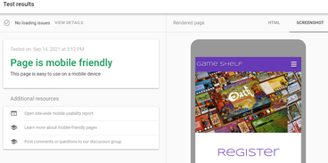
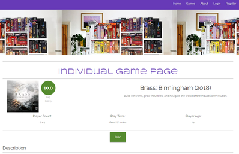
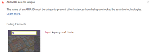
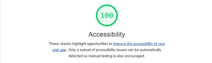

# Testing

[README.md](README.md)

## Table of Contents

- [Automated Testing](#Automated-Testing)
  - [Validation](#Validation)

- [Manual Testing](#Manual-Testing)
  - [Testing Environments](#Testing-Environments)
  - [Unit Testing](#Unit-Testing)
  - [Peer Code Review](#Peer-Code-Review)
  - [Student Checklist](#Student-Checklist)
  - [Testing User Stories](#Testing-User-Stories)
- [Project Bugs and Solutions](#Project-Bugs-and-Solutions)
- [Known Issues](#Known-Issues)

## Automated Testing

### Validation

**HTML** and **CSS** code were validated with the W3C Markup and CSS validators. 

<b>HTML</b>

<b>CSS</b>

[W3C](https://jigsaw.w3.org/css-validator/) - CSS Validation

Javascript code was run through [JSHint](https://jshint.com/) to ensure it was syntactically correct.

<b>Javascript</b>

Pylint was used to validate Python code. Any errors were corrected and re-run until correct. 

<b>Python</b>

* The unbalanced tuple is part of the pagination code, and does not produce an actual error.
* A warning regarding unused-imports remains as the linter is unable to recognise the use of variables in env.py.

Google Chrome's <b>lighthouse</b> was also run and provided the following reports:

<b>Lighthouse</b>

Home page

- [Mobile](static/images/lighthouse/lighthouse-home-mob.png)
- [Desktop](static/images/lighthouse/lighthouse-home.png)

login page

- [Mobile](static/images/lighthouse/lighthouse-login-mob.png)
- [Desktop](static/images/lighthouse/lighthouse-login.png)

register page
- [Mobile](static/images/lighthouse/lighthouse-register-mob.png)
- [Desktop](static/images/lighthouse/lighthouse-register.png)

games page

- [Mobile](static/images/lighthouse/lighthouse-games-mob.png)
- [Desktop](static/images/lighthouse/lighthouse-games.png)

individual game page

- [Mobile](static/images/lighthouse/lighthouse-ind-game-mob.png)
- [Desktop](static/images/lighthouse/lighthouse-ind-game.png)

profile page

- [Mobile](static/images/lighthouse/lighthouse-profile-mob.png)
- [Desktop](static/images/lighthouse/lighthouse-profile.png)

about page

- [Mobile](static/images/lighthouse/lighthouse-about-mob.jpg)
- [Desktop](static/images/lighthouse/lighthouse-about.jpg)

Ensured the website was also responsive on all pages through [Google Mobile Friendly Test](https://search.google.com/test/mobile-friendly).

<b>Mobile Friendly Test</b>

* Home -

* Games - 

* Individual Game Page - 

* About - 

* Login - 

* Register - 

## Manual Testing

* Forms testing: to ensure the website was functioning as it should, I tested each of the forms on different devices and browsers. This was done by clicking the 'Submit' button on the Add & Edit Review forms, and on the Add & Edit Games forms without any text in inputs to make sure they resulted in the desired response of 'Please fill out this field'. Each 'required' input was tested individually on all forms to ensure the validation responded appropriately each time.

* Links (Internal & External): Each of the links when clicked have been checked so that the user is directed to the desired location. For a better UX experience, all external links included a target="_blank" attribute so that a new browser tab is opened when clicked.

### Testing Environments
Primary testing was undertaken on a Windows 10 desktop machine with the Google Chrome browser. 

**Desktop testing**

- Platforms:
  - Custom Desktop (Windows 10)
  - ASUS E410MA Laptop (Windows 10)
- Browsers:
  - Google Chrome
  - Microsoft Edge
  - Firefox
  - Opera
  - Safari

**Tablet testing**

- Platforms:
  - Samsung Tab A6 (Android 10)
  - Samsung Tab A4 (Android 10)
  - iPad Pro 12.9 2020 (IOS 14)
- Browsers:
  - Google Chrome
  - Firefox
  - Safari

**Mobile testing**

- Platforms:
  - Samsung Galaxy S8 (Android 10)
  - Samsung Galaxy A42 (Android 10)
  - iPhone 12 Pro (IOS 14)
  - iPhone 11 (IOS 14)
- Browsers:
  - Chrome
  - FireFox
  - Safari

### Testing
Manual testing was conducted to test functions and database entry submissions. In this way most bugs were caught and fixed before they were committed to the repository or live site.

The python print() and JavaScript console.log functions were used to output variable values and breakpoints during development to give hints to where faults were occurring and why.

### Peer Code Review

The project was submitted for peer code review on the Code Institute Slack [channel](https://code-institute-room.slack.com/archives/CGWQJQKC5/p1631878731174400)

### Student Checklist

### Testing User Stories
- #### First Time Visitor Goals

  1. As a First Time Visitor, I want to easily understand the main purpose of the site and learn more about board games.
  > * Home page welcome message make site purpose immediately clear
  > * Prominent header image reinforces site message

  2. As a First Time Visitor, I want to be able to easily navigate the site to find content.
  > * Prominent, clearly labelled navbar on desktop site and navbar toggle on tablet/mobile
  > * Hover effect on navbar links to aid navigation
                       
- #### Returning Visitor Goals

  1. As a Returning Visitor, I want to find information about games I may want to play
  > * Latest reviews highlighted on homepage loading
  > * Basic game information displayed on Games page
  > * Full information provided on individual game pages

  2. As a Returning Visitor, I want to share my reviews of games I have played   
  > * 'Review' button for each unreviewed game on Games page
  > * 'Review' button present on individual game page
  > * 'Add Review' button present whenever user accesses Profile page  

- #### Frequent User Goals

  1. As a Frequent User, I want to check to see if there are any new reviews.
  > * Latest Reviews presented on homepage and Games page

  2. As a Frequent User, I want to organise reviews I've written on my profile.
  > * Users can view all their reviews on Profile page collapsible
  > * Users can add, read, edit or delete any of their reviews from Profile page

- #### Site Owner Goals

  1. As a Site Owner, I want to earn money on games purchased through affiliate links
  > * 'Buy' button present for all games on Games page
  > * 'Buy' button also present on individual game pages
  > * 'Buy' buttons link to external affiliate link

  2. As a Site Owner, I want to be able to manage and maintain the games database
  > * Admin users have 'Add Game' button on Profile to add new games to database
  > * 'Edit Game' button for every game present on Games page and individual game pages
  

## Project Bugs and Solutions
* CSS for page overflow and x-scrolling meant the games catalogue table was cutting off anything that went beyond the edge of the screen on mobile devices; removing overflow:hidden meant that any horizontal scrolling moved the whole page (leaving ugly whitespace on the righthand side of the page). In order to add x-scrolling to the catalogue table only, I found and used an answer from [Serge Stroobandt](https://stackoverflow.com/a/30423904) on Stack Overflow which meant users are able to scroll horizontally in the table only without compromising the layout of the table itself, or adding any whitespace to other elements on the page.
* Adding 'if' condition to check for existing user reviews on the individual game pages inadvertently prevented non-registered users from viewing the games at all, as the 'user' key couldn't be found (because 'user' was only created on login). 

In order to fix this, I introduced an additional first 'if' condition to check whether there was a 'user' in the session, and then used Jinja templates on the view_game.html page to add several 'if/else' conditions to alter the displayed HTML depending on the 'user' status, and to bypass the existing_review 'if' condition if there is no session 'user'.

 

* During testing, I found it was possible for users to submit reviews without selecting a rating, which led to a TypeError on the screen while still creating a review in the database with a game rating equal to 'None'. To prevent this, I added the 'required' attribute to the rating select input on both the 'Edit Review' and 'Add Review' forms which had not been present previously.

* While generating Lighthouse reports during testing, Accessibility scores were affected by the navbar search box and toggler search box sharing the same ID. 

As this could potentially effect user experience on screen readers and prevent users accessing the search functionality, I renamed the toggler search element and rerouted the python function to generate the same template as the desktop search.

## Known Issues

### Lighthouse

* A number of the lighthouse reports flag issues with slow performance, mostly stemming from downloading large image files. Using software to convert images to WebP or AVIF formats would mitigate these issues in future
